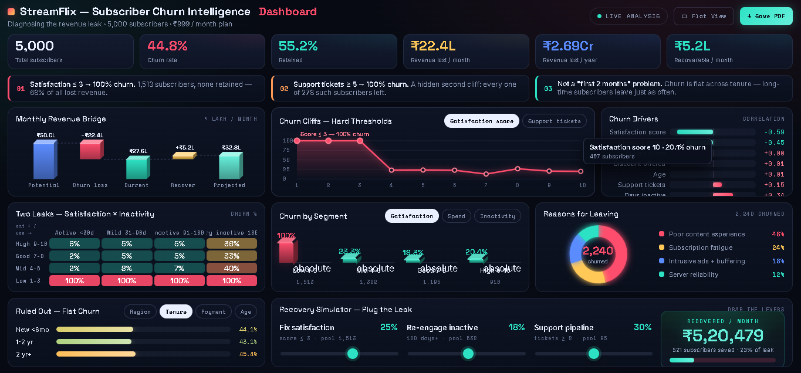

#StreamFlix — Subscriber Churn & Revenue Risk Intelligence

> A streaming service was quietly losing **₹2.69 crore a year** — and nobody knew why. This is the story of how the data revealed exactly where the money was leaking, and who was walking out the door.

**📊 [Explore the Live Interactive Dashboard →](https://cdelta1999-ui.github.io/StreamFlix-Customer-Churn-Analysis/)**

---

## The Story

StreamFlix had a growth problem disguised as a success story. Every month, marketing poured money into ads, and every month, thousands of new subscribers signed up for the ₹999/month plan. On paper, the funnel looked healthy.

But behind the scenes, the bucket was leaking — badly. Nearly **half of all subscribers were canceling**, and the company couldn't see where, or why. They were refilling a bucket faster than they could find the holes. That's when I was brought in with a single mandate: *find the holes.*

The first look at the database was sobering. Of **5,000 subscribers, 44.8% had churned** — a leak draining **₹22.4 lakh every month**, or **₹2.69 crore a year**. But a number that big doesn't tell you where to dig. So I stopped asking "how many are leaving?" and started asking a sharper question: **"At exactly what point does a customer decide to leave?"**

That question changed everything.

---

## What the Data Confessed

**The Satisfaction Cliff.** When I segmented subscribers by satisfaction score, a wall appeared. Every single customer who rated their experience **3 or below left the company — a 100% churn rate, zero survivors.** This one group of **1,513 subscribers** was responsible for roughly **68% of all lost revenue.** The largest hole in the bucket wasn't hidden at all; it was hiding in plain sight, in the satisfaction scores no one was acting on.

**The Support-Ticket Cliff.** Then a second wall emerged. Every subscriber who raised **5 or more support tickets also churned — all 278 of them, without exception.** Each unresolved ticket was a customer quietly walking toward the exit, and the fifth ticket was effectively a goodbye.

**The Myth That Fell Apart.** Leadership was convinced churn was a "new customer" problem — people leaving in the first couple of months. The data disagreed. **Churn was flat across every tenure band:** loyal, long-time subscribers were leaving at almost the same rate as brand-new ones. This wasn't an onboarding problem. It was an *experience* problem, and it never stopped.

---

## 💰 The Bottom Line

| Metric | Value |
| --- | --- |
| Total subscribers analyzed | **5,000** |
| Churn rate | **44.8%** |
| Retention rate | **55.2%** |
| Revenue lost / month | **₹22.4 L** |
| Revenue lost / year | **₹2.69 Cr** |
| Realistically recoverable / month | **₹5.2 L** |

The leak wasn't random. It was concentrated, predictable, and — most importantly — **fixable.**

---

## How to Plug the Leak

- **Catch unhappiness before the next bill.** Any satisfaction score ≤3 should trip an alarm and trigger proactive outreach. This is where the biggest, most recoverable revenue lives.
- **Never let a customer reach their fifth ticket.** Route accounts nearing 5 tickets straight to senior support. The fifth ticket isn't a complaint — it's a resignation letter.
- **Stop treating retention as an onboarding task.** Because churn is tenure-blind, retention investment must protect the *entire* lifecycle, not just the first 60 days.

---

## Tools & Workflow

- **SQL** — Built the root-cause diagnostic engine (`streamflix_churn_analysis.sql`): executive KPI rollups, window-function revenue attribution, conditional "cliff" threshold tests, and pain-point segmentation.
- **Excel** — Initial exploration, cleaning, and validation of 5,000 customer records.
- **HTML / CSS / Vanilla JS** — Hand-coded a responsive executive dashboard (`index.html`) with custom Canvas-rendered charts and a 3D-tilt interface — no off-the-shelf BI tools.

---

## 📁 Repository Structure

| File | Description |
| --- | --- |
| `streamflix_churn_analysis.sql` | The full SQL investigation — KPIs, cliff tests, revenue attribution, segmentation |
| `streamflix_data.xlsx` | Source dataset (5,000 subscriber records) |
| `index.html` | Self-contained interactive executive dashboard |
| `dashboard_screenshot.png` | Static preview of the live dashboard |

---

## 🧭 The Method Behind the Story

The SQL script reads like the investigation itself — four phases, each building on the last: staging and schema setup, top-line executive KPIs and macro revenue leakage, high-conviction "diagnostic cliff" threshold tests for satisfaction and support load, and finally qualitative pain-point segmentation with window-function revenue attribution. Every claim in the story above traces back to a specific query, so the narrative stays fully auditable from headline to evidence.

---

*Author: Daliya Chakraborty · Domain: Subscription-Based Digital Ecosystems*
